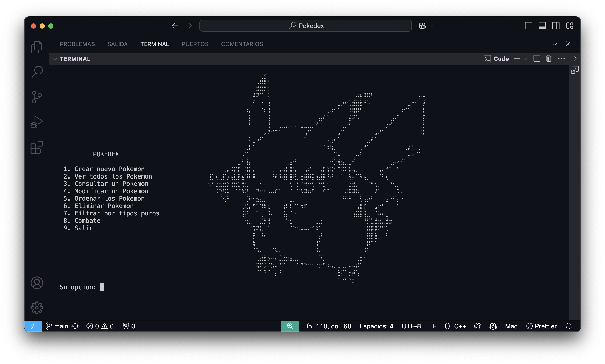

# Pokedex-in-terminal
Pokedex made in c with different options

This project consists of developing an interactive Pokédex (Pokémon database) that allows users to manage and consult information mainly about the 151 Pokémon from the first generation of the franchise. The application allows operations such as adding, listing, consulting, modifying, sorting, filtering, fighting and deleting Pokémon records in the database.

The database is stored in a binary file and is managed through data structures defined in C++. Each Pokémon includes attributes such as id, name, type and combat statistics, following the classic model of the Pokédex of the Pokémon video games.
The application has an interactive menu to facilitate navigation and use of its functionalities.
**Main features:** - Automatic loading of the 151 Pokémon from the first generation, avoiding the user having to enter everything from scratch.
- Possibility of adding new Pokémon or updating existing ones.
- Handling of binary files to store and retrieve Pokédex data.
- CRUD operations: Create, Read, Update and Delete records.
- Record sorting features to facilitate queries.

VSC version 1.93.1 November 13, 2024 Juan Pablo García

